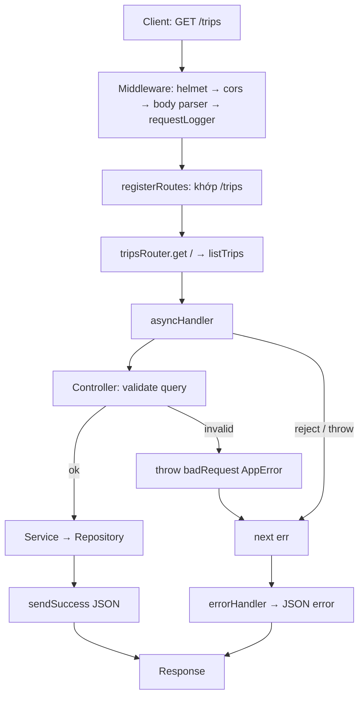

# Thư mục `app`

Đây là lớp **khởi tạo HTTP server**: tạo Express app, chuỗi middleware toàn cục, đăng ký route và middleware xử lý lỗi cuối cùng.

## File trong thư mục

| File | Vai trò |
|------|---------|
| `createApp.ts` | `express()`, gắn middleware theo thứ tự, gọi `registerRoutes`, gắn `errorHandler`. |
| `routes.ts` | Mount các router module (prefix như `/health`, `/trips`) và tùy chọn Swagger UI tại `/docs`. |

Process entry vẫn là `src/index.ts` (ngoài thư mục này): load config → `createApp()` → `listen`.

## Luồng một request (end-to-end)

1. Request vào server đã được `app.listen` trong `src/index.ts`.
2. Middleware toàn cục trong `createApp.ts` chạy **theo thứ tự**:
   - `helmet` → `cors` → `express.json` / `urlencoded` → `cookieParser` → `requestLogger`.
3. `registerRoutes(app)` khớp prefix và chuyển sang **router của từng module** (vd. `app.use('/trips', tripsRouter)` trong `routes.ts`).
4. Handler trên router (vd. `GET /` trên `tripsRouter` → `GET /trips`) thường là controller được bọc **`asyncHandler`** (`src/common/utils/asyncHandler.ts`): lỗi async được chuyển thành `next(err)`.
5. Controller validate input (thường Zod `safeParse`), gọi **service** → **repository** / Prisma khi cần.
6. Thành công: **`sendSuccess`** (`src/common/utils/response.ts`) → `{ success: true, data, meta? }`.
7. Lỗi: **`errorHandler`** (`src/common/middleware/errorHandler.ts`) format JSON lỗi thống nhất (ZodError / AppError / lỗi khác).

**Lưu ý:** `errorHandler` được gắn **sau** `registerRoutes`; nó chỉ chạy khi có lỗi được đưa vào pipeline qua `next(err)` (hoặc lỗi đồng bộ trong middleware/handler).

## Sơ đồ (ví dụ `GET /trips`)

## Liên kết code hay dùng khi đọc luồng

- Response thành công: `src/common/utils/response.ts`
- Bọc async route: `src/common/utils/asyncHandler.ts`
- Lỗi HTTP có mã: `src/common/errors/httpErrors.ts`, `AppError`
- Định nghĩa route từng module: `src/modules/**/route.ts`

Tài liệu tổng quan project: `README.md` ở root repo.
